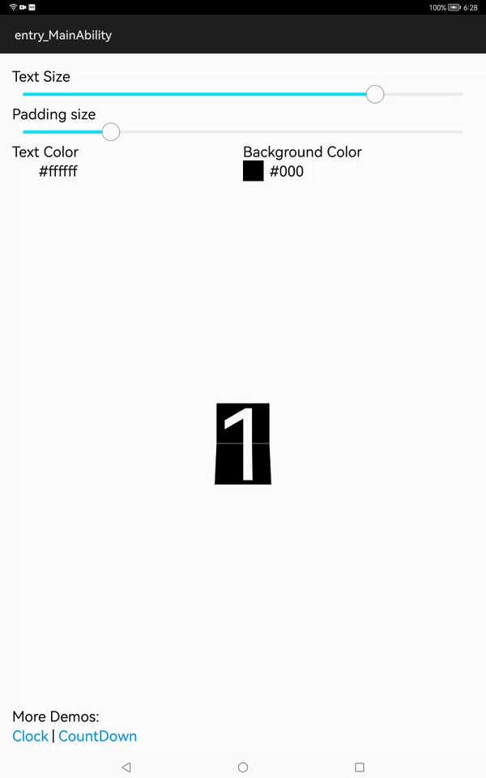
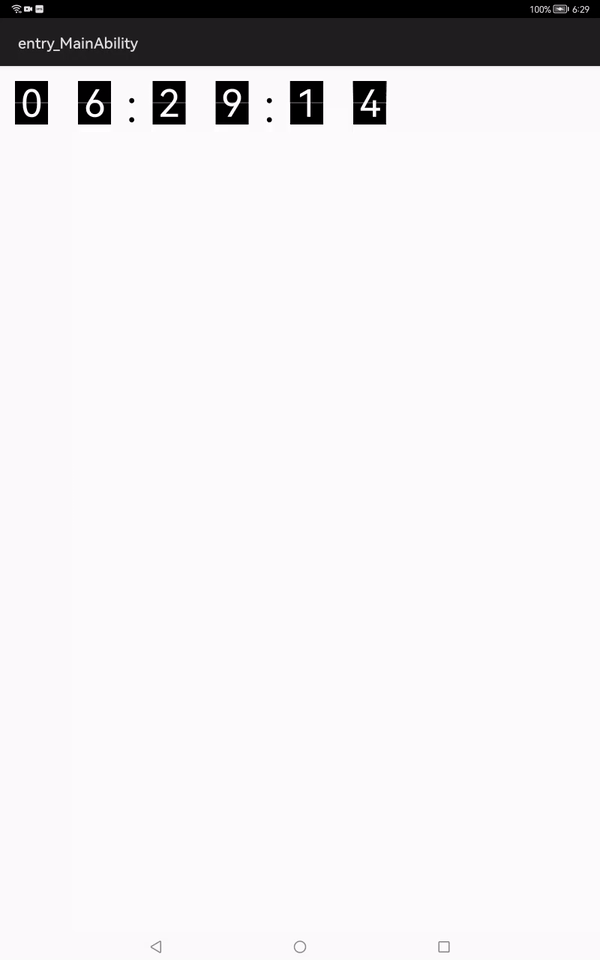

# Tab Digit
A Flip Clock Library

### Source
---
This library has been inspired by [xenione/tab-digit](https://github.com/xenione/tab-digit)



this is what you can do with Tab digit



### Integration
**From Source**
1. For using Tab Digit module in sample app, include the source code and add the below dependencies in entry/build.gradle to generate hap/support.har.
    ```groovy
    implementation project(path: ':digit')
    ```
2. For using Tab Digit module in separate application using har file, add the har file in the entry/libs folder and add the dependencies in entry/build.gradle file.
    ```groovy
   implementation fileTree(dir: 'libs', include: ['*.har'])
   
### Usages
Add tabdigit in your layout, you can set attributes like background or text color, text size and padding through xml as shown.
```xml
<com.xenione.digit.TabDigit
    ohos:id="$+id:tabDigit1"
    ohos:height="match_content"
    ohos:width="match_content"
    digit:backgroundColor="#000000"
    digit:textColor="#ffffff"
    digit:padding="10vp"
    digit:textSize="160fp"
    />
```

start animation calling start().

```java
tabDigit1.start();
```  
Increase digit every second:
```java
EventHandler eventHandler = new EventHandler(EventRunner.getMainEventRunner()); 
@Override
public void run() {
    tabDigit1.start();
    eventHandler.postTask(this, 1000);
}
```


Take a look at the [sample project](entry) for more information.


# License
-------
    Copyright 2016 Eugeni Josep Senent i Gabriel

    Licensed under the Apache License, Version 2.0 (the "License");
    you may not use this file except in compliance with the License.
    You may obtain a copy of the License at

       http://www.apache.org/licenses/LICENSE-2.0

    Unless required by applicable law or agreed to in writing, software
    distributed under the License is distributed on an "AS IS" BASIS,
    WITHOUT WARRANTIES OR CONDITIONS OF ANY KIND, either express or implied.
    See the License for the specific language governing permissions and
    limitations under the License.